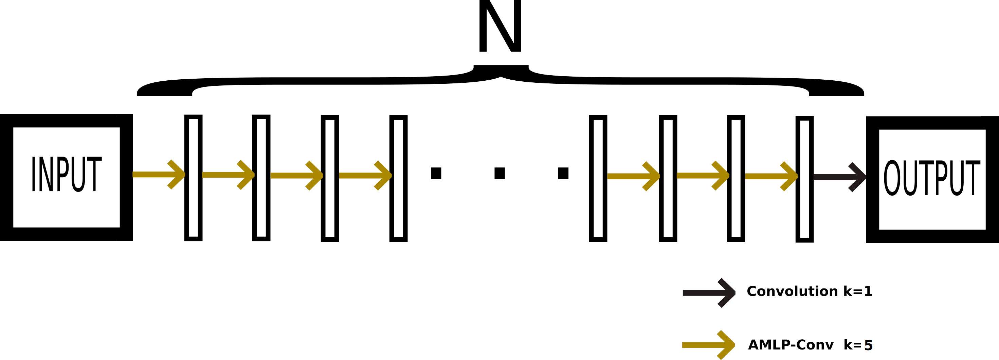

# AMLP-Conv, a 3D Axial Long-range InteractionMultilayer Perceptron for CNNs
* [Introduction]

Published in MLMI 2022, the 3D Axial Multilayer Perceptron (AMLP) is a long-range interaction module whose complexity scales linearly with spatial dimensions.
This module is merged with CNNs to form the AMLP-Conv module, a long-range augmented convolution with strong inductive biases. Once combined with U-Net, our AMLP-Conv module leads to significant improvement, outperforming most transformer based U-Nets on the ACDC dataset, and reaching a new state-of-the-art result on the Multi-Modal Whole Heart Segmentation (MM-WHS) dataset with an almost 1.1% Dice score improvement over the previous scores on the Computed Tomography (CT) modality.


```
@inproceedings{,
  title={AMLP-Conv, a 3D Axial Long-range InteractionMultilayer Perceptron for CNNs},
  author={Bonheur, Savinien and Pienn, Michael and Olschewski, Horst and Bischof, Horst and Urschler, Martin},
  booktitle={},
  pages={},
  year={2022},
  organization={Springer}
}
```
* [Experiment]
### 3-folds cross-validation comparison of a 3D-Unet, a 3D-AMLP-Unet and a AMLP-Line(see below):



Dice scores of the evaluated networks in % (mean ± standard deviation) using a three-fold cross-validation averaged over 4 runs on the training images of the MM-WHS challenge. The input images’ modality is indicated the ”Data Type” column. Results shown for the individual cardiac structures (LV - left ventricle, Myo - left ventricle myocardium, RV - right ventricle, LA -left atrium, RA -right atrium, aorta - ascending aorta, PA - pulmonary artery and the mean Dice score over the seven heart substructures). The number of network parameters is shown as multiples of thousands.* indicate statistical significance p<0.05


* [Acknowledgement]
This implementation uses the following repository [link](https://github.com/christianpayer/MedicalDataAugmentationTool)

